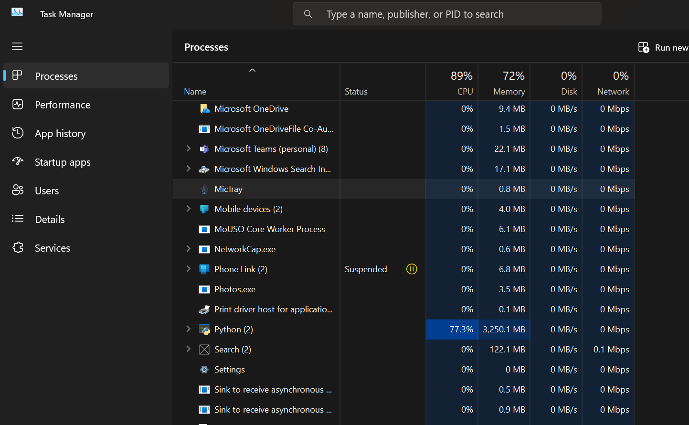
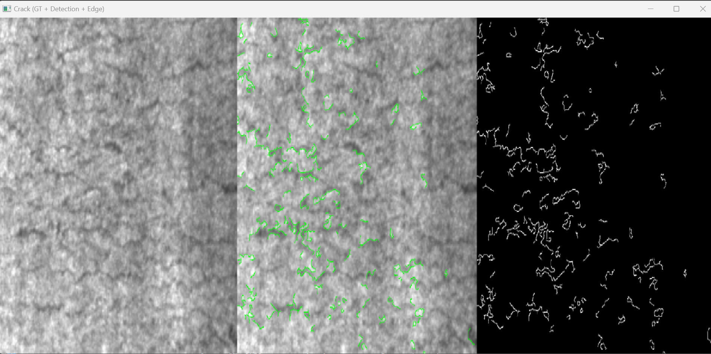
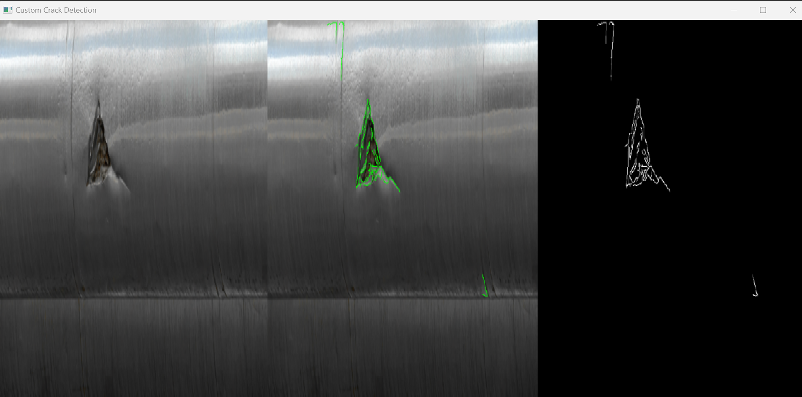

# Crack and Corrosion Detection

## Overview

This project performs crack and corrosion detection using traditional image processing techniques without machine learning.

## Features

* Crack detection using Canny edge detection and contours
* Corrosion detection using HSV color segmentation
* Supports:

  * Crack detection with XML annotations
  * Crack detection without annotations (custom dataset)

## Technologies

* Python
* OpenCV
* NumPy

## How to Run

1. Install dependencies:
   pip install opencv-python numpy

2. Run the file:
   python test.py

3. Select mode:

   * c → corrosion detection
   * k → crack detection (with XML)
   * s → crack detection (without XML)

## Dataset

Update dataset paths in the code before running.

## Results

### Corrosion Detection

### Crack Detection (NEU-DET)

### Custom Crack Detection

## Author

Yashaswini
